# Android Notes

This App is developed as a learning project to get into Android development using Java. It serves as a practical exploration of various essential technologies and patterns commonly used in Android app development.

## Tech Stack

**Java**: The primary programming language used.

**MVVM (Model-View-ViewModel)**: Design pattern for separating development of user interface from the business logic.

**LiveData**: Data objects that notify views when the underlying database changes.

**Room Database**: SQLite object mapping library to provide an abstraction layer over SQLite.

**Data/ViewBinding**: Binding views and data to layout files.

**Shared Preferences**: Simple key-value pairs to store primitive data types persistently.

**Jetpack Navigation Component**: A component that helps to implement navigation between fragments.

**SafeArgs**: Type-safe argument passing between fragments.

**TapTargetView Library**: Library for displaying sequence of tap targets with descriptions.

## Screenshots
### The logo used in this application has been created by AI.
| Splash       | Empty Feed           | Notes 
| ------------- |:-------------:| -----:|
| 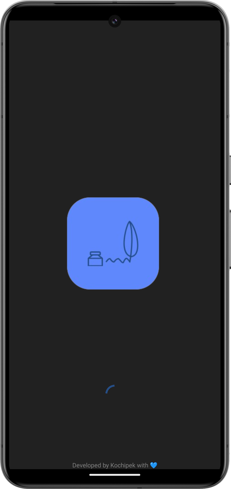 </img>      | 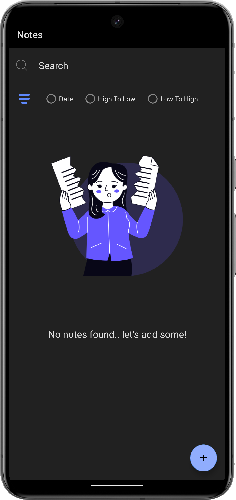 </img> |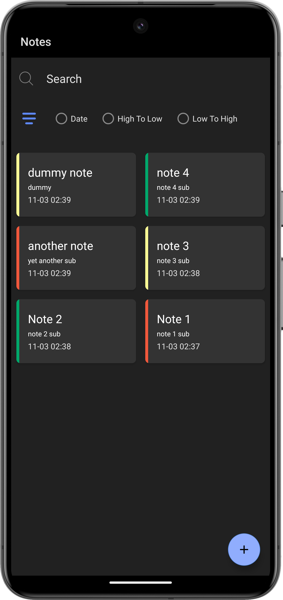 </img> |

| Walkthrough 1        | Walkthrough 2           | Walkthrough 3   
| ------------- |:-------------:| -----:|
| 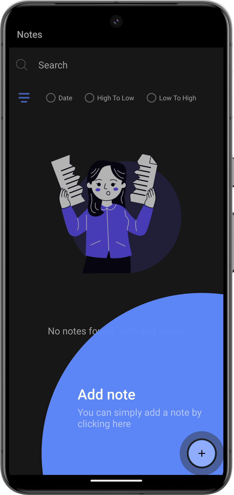 </img>      | 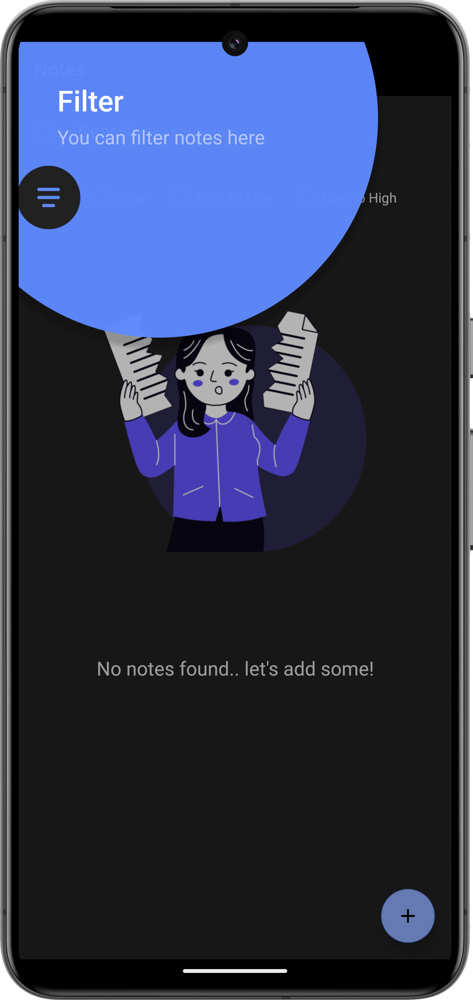 </img> |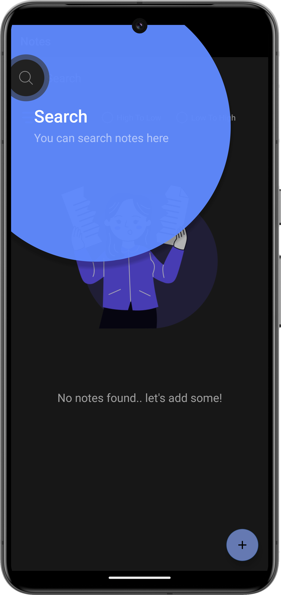 </img> |

| Filter by Date        | Filter high priority           | Filter low priority   
| ------------- |:-------------:| -----:|
| 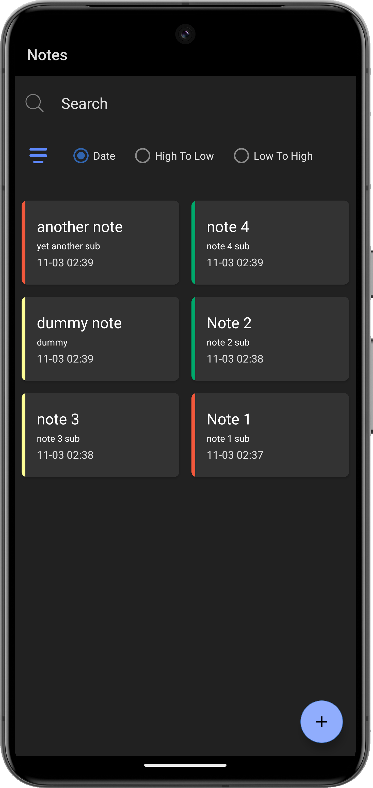 </img>      | 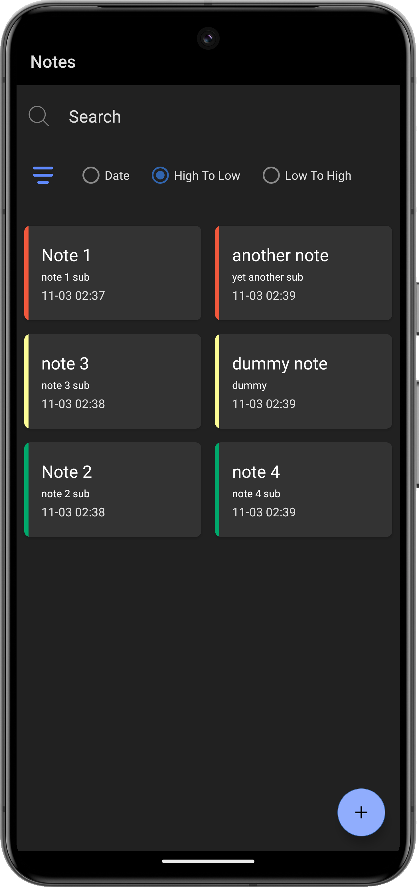 </img> |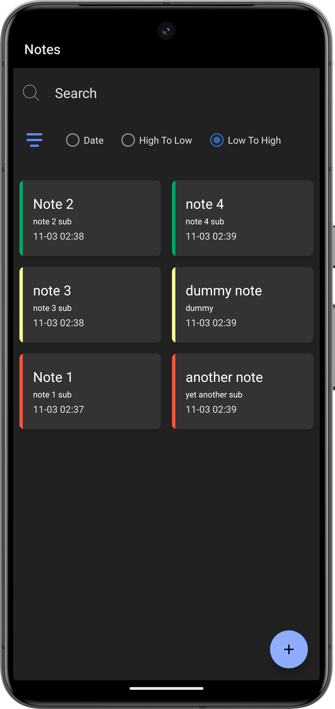 </img> |

| Add Note        | Update Note           | Delete Note   
| ------------- |:-------------:| -----:|
| 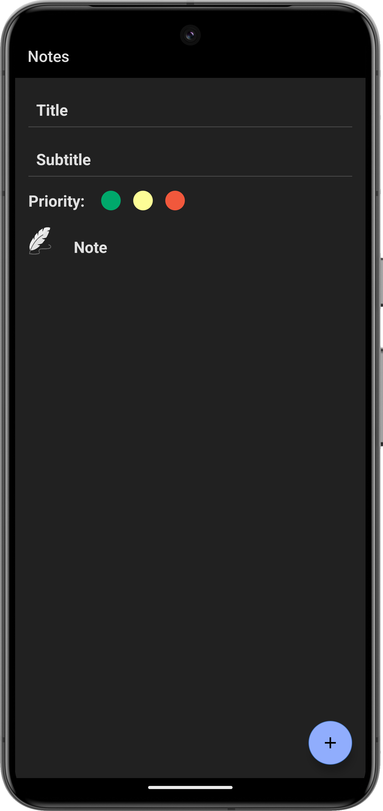 </img>      | 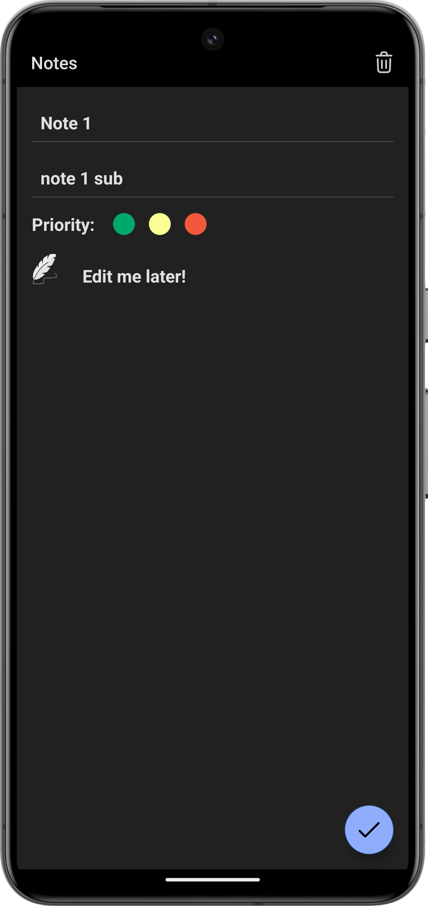 </img> |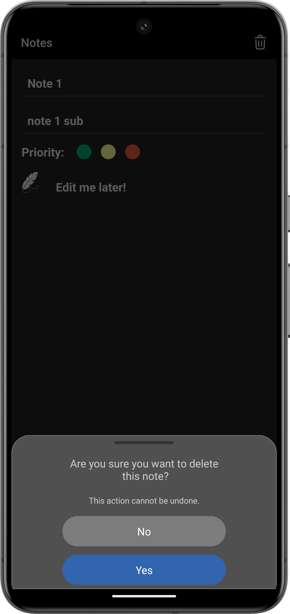 </img> |

## Features

- Add Note
- Select Note Priority
- Filter notes by date, high and low priority
- Update
- Delete
- Search

#### Todo Features

- Add Images
- Add Voices
- Add tags
- Todo list option

## Contributing

Contributions are always welcome!

